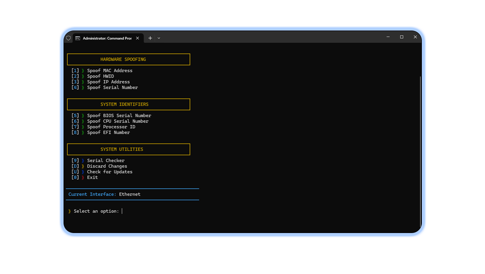

# 🛡️ PhantomID - Hardware ID Spoofer

<p align="center">
  
  
  
</p>

<p align="center">
  
  
  
</p>

## 📋 Overview
PhantomID is a powerful hardware ID spoofing tool designed to modify system identifiers for privacy and security purposes. It allows you to change various hardware identifiers including MAC addresses, HWID, IP addresses, serial numbers, and more.


## ✨ Features
- Spoof MAC Address
- Spoof Hardware ID (HWID)
- Spoof IP Address
- Spoof Serial Numbers
- Spoof BIOS Serial Number
- Spoof CPU Serial Number
- Spoof Processor ID
- Spoof EFI Number
- System Serial Checker
- Automatic Updates
- Change History Database

## 🔧 Requirements
- Windows Operating System
- Python 3.6+
- Required Python packages:
  - colorama
  - wmi
  - requests
  - sqlite3 (included with Python)

## 📥 Installation
1. Clone or download this repository
2. Install required packages:

```bash
pip install colorama wmi requests
 ```

3. Run the application:

```bash
python spoofer.py
 ```

## 📚 Usage
1. Launch the application
2. Select the desired spoofing option from the menu
3. Follow the on-screen instructions
4. Changes will be saved to the database automatically
## ⚠️ Warning
- Use this tool responsibly and at your own risk
- Modifying hardware identifiers may affect system functionality
- Some changes require administrator privileges
- Always create a system restore point before making changes
## 🔍 Troubleshooting
- If you encounter issues, use the "Discard Changes" option to revert to original values
- Make sure to run the application with administrator privileges
- Check the database file (phantomid.db) for integrity if the application fails to start
## 🔄 Updates
The application includes an automatic update feature. Select "Check for Updates" from the menu to download the latest version.

## 📜 License
This software is provided as-is without any warranty. Use at your own risk.

## 📞 Contact
For issues or feature requests, please open an issue on the GitHub repository.

Made with ❤️ for privacy enthusiasts
