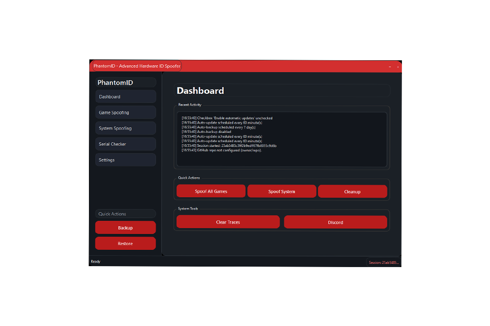

# 🛡️ PhantomID - Hardware ID Spoofer

<p align="center">
  
  
</p>

<p align="center">
  
  
  
  <a href="https://discord.gg/rfWdrewbAz" target="_blank">
    
  </a>
</p>

## 📋 Overview
PhantomID is a powerful hardware ID spoofing tool designed to modify system identifiers for privacy and security purposes. It allows you to change various hardware identifiers including MAC addresses, HWID, IP addresses, serial numbers, and more.


**What’s New in v2.0**
- PySide6 UI with a multi-page layout (dashboard, spoofers, settings, backup, history).
- Integrated per‑game spoofers: `FiveM`, `Fortnite`, `Valorant`.
- Anti‑Detection Manager to randomize timings, obfuscate strings, clear traces, and spoof file timestamps.
- Expanded database schema: `changes`, `game_spoofs`, `registry_changes`, `backup_metadata`, `sessions` with indexes and cleanup utilities.
- Auto‑Updater tied to GitHub Releases and tags (fetches zipballs, applies updates, stores `last_release_tag`).
- Rich system info collection (BIOS, baseboard, computer system, CPU, GPU, disks, network adapters, OS, registry, volumes) with formatting helpers.

## ✨ Features
- Spoof MAC Address
- Spoof Hardware ID (HWID)
- Spoof IP Address
- Spoof Serial Numbers
- Spoof BIOS Serial Number
- Spoof CPU Serial Number
- Spoof Processor ID
- Spoof EFI Number
- System Serial Checker
- Automatic Updates
- Change History Database
- Game Spoofing Modules (FiveM, Fortnite, Valorant)

## 🔧 Requirements
- Windows Operating System
- Python 3.6+
- Required Python packages:
  - PySide6
  - wmi
  - requests
  - sqlite3 (included with Python)

## 📥 Installation
1. Clone or download this repository:

```bash
git clone https://github.com/NikolisSecurity/PhantomID.git
```

2. Install required packages:

```bash
pip install -r requirements.txt
 ```

3. Run the application:

```bash
python spoofer.py
 ```

## ❓ FAQ
- Does this bypass anti‑cheat? No guarantees. Use responsibly and respect TOS.
- Are changes permanent? Most are OS‑level; backups/restores and reboots may revert certain states.
- Linux support? v2.0 targets Windows; cross‑platform support isn’t provided YET.
- Will this harm my PC? Improper use can affect system behavior. Create backups.
## ⚠️ Warning
- Use this tool responsibly and at your own risk
- Modifying hardware identifiers may affect system functionality
- Some changes require administrator privileges
- Always create a system restore point before making changes
## 🔍 Troubleshooting
- If you encounter issues, use the "Restore" option to revert to original values
- Make sure to run the application with administrator privileges
- Check the database file (phantomid.db) for integrity if the application fails to start

## 📜 License
This software is provided as-is without any warranty. Use at your own risk.

## 📞 Contact
For issues or feature requests, please open an issue on the GitHub repository.

Made with ❤️ for privacy enthusiasts
